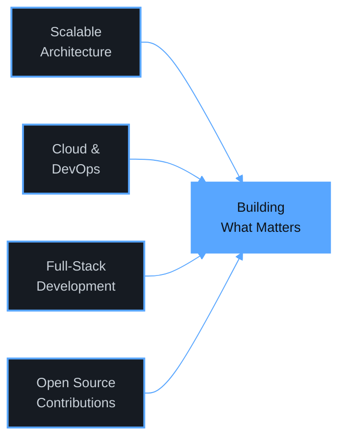

<div align="center">

<a href="https://git.io/typing-svg"></a>

<br/>


&nbsp;&nbsp;
<a href="https://linkedin.com/in/vikrantwiz02"></a>
<a href="https://www.vikrantkumar.site/"></a>
<a href="mailto:vikrantkrd@gmail.com"></a>

</div>

---

## About Me

I'm a full-stack developer at **IIITDM Jabalpur, India**, focused on building products that ship — not just prototypes that demo well. I work across the stack: from crafting responsive UIs in React to designing scalable backend services and deploying them on cloud infrastructure.

What drives me is turning messy, real-world problems into clean, working software. I care about writing code that other engineers can read, maintain, and trust in production.

```typescript
const vikrant = {
    location: "IIITDM Jabalpur, India",
    roles: ["Full-Stack Developer", "Cloud Enthusiast", "Open Source Contributor"],
    currentlyBuilding: ["Saviour 2.0", "HydroTech", "ICAORFDI-2026"],
    techStack: {
        frontend:  ["React", "Next.js", "React Native", "TypeScript", "Tailwind CSS"],
        backend:   ["Node.js", "Express.js", "Python", "GraphQL"],
        databases: ["PostgreSQL", "MongoDB", "Firebase"],
        devops:    ["Docker", "AWS", "CI/CD", "GitHub Actions"],
    },
    philosophy: "Ship fast, iterate faster, never stop learning.",
};
```

---

## Tech Stack

<div align="center">

#### Languages & Frameworks


#### Databases & Cloud


</div>

---

## Featured Projects

| # | Project | Stack | What it does | Status |
|:-:|---------|-------|--------------|:------:|
| 1 | **[ORSI-2025 & ICAORFDI-2026](https://github.com/vikrantwiz02?tab=repositories)** | `React` `TypeScript` | Conference platform for international OR research in finance, defence & industry | 🟢 Active |
| 2 | **[Saviour](https://github.com/vikrantwiz02?tab=repositories)** | `React Native` `Expo` `Firebase` `TypeScript` | Mobile community safety app — real-time alerts & location-based emergency services | 🟢 Active |
| 3 | **[Saviour 2.0](https://github.com/vikrantwiz02?tab=repositories)** | `React` `Node.js` `Firebase` `TypeScript` | Web counterpart of Saviour with expanded features and admin dashboard | 🟢 Active |
| 4 | **[IIITDMJ Website](https://github.com/vikrantwiz02?tab=repositories)** | `React` `Tailwind` `Firebase` | Institutional website with CMS and student portal integration | 🟢 Active |
| 5 | **[CFD Simulator](https://github.com/vikrantwiz02?tab=repositories)** | `Python` `NumPy` `Matplotlib` | Computational fluid dynamics simulation engine with interactive visualizations | 🔬 Research |
| 6 | **[HydroTech](https://github.com/vikrantwiz02?tab=repositories)** | `Python` `React` `Node.js` `MongoDB` | AI-powered groundwater analytics platform for sustainable water management | 🟢 Active |

> **Explore all projects:** [GitHub Repositories](https://github.com/vikrantwiz02?tab=repositories) · [Live Portfolio](https://www.vikrantkumar.site/)

---

## GitHub Analytics

<p align="center">
  
  
  
</p>

<p align="center">
  
</p>

<p align="center">
  
</p>

---

## Certifications

<div align="center">

| Certification | Issuer | Year |
|:---:|:---:|:---:|
| 🏅 **Google IT Support Professional** | Google Career Certificates | 2024 |
| ☁️ **AWS Cloud Practitioner** | Amazon Web Services | 2024 |

</div>

---

## What I'm Focused On



---

<div align="center">

### Let's Build Something Together

I'm always open to interesting conversations through code, collaboration, or coffee (virtual works too).

<a href="https://linkedin.com/in/vikrantwiz02"></a>
<a href="mailto:vikrantkrd@gmail.com"></a>
<a href="https://github.com/vikrantwiz02"></a>
<a href="https://www.vikrantkumar.site/"></a>

---

<sub>© 2026 Vikrant Kumar — Built with purpose, shipped with care.</sub>

</div>
