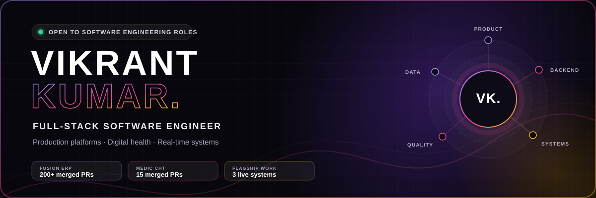
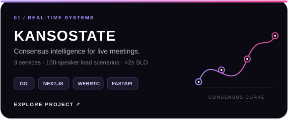
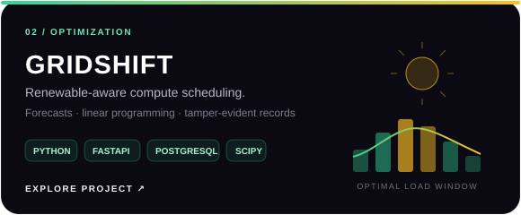
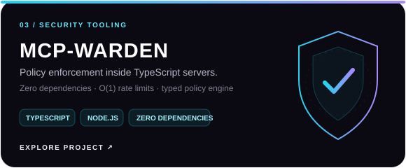
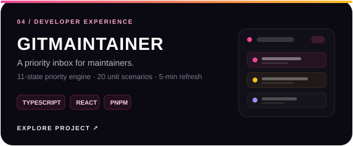

  

  
  
  
  

  <strong>I turn complex workflows into software that people can rely on.</strong> 
  B.Tech CSE at IIITDM Jabalpur · 2023–2027 · C4GT'26 Contributor · Building from interface to infrastructure

## Selected engineering work

  
  

  
  

  
    Live: <a href="https://kansostate.vikrantkumar.site">KansoState</a> ·
    <a href="https://gridshift.vikrantkumar.site">GridShift</a> ·
    <a href="https://git-maintainer-web.vercel.app">GitMaintainer</a> ·
    Package: <a href="https://www.npmjs.com/package/mcp-warden">mcp-warden</a>
  

## Production impact

### Fusion ERP · Full-Stack Developer

> **200+ merged pull requests across four repositories.** I work across React interfaces, Django services, relational models, permissions, tests, and CI for IIIT Jabalpur's institutional platform.

Recent work includes:

- Built a resumable course-allocation workflow across [backend #1967](https://github.com/FusionIIIT/Fusion/pull/1967) and [client #299](https://github.com/FusionIIIT/Fusion-client/pull/299).
- Generalized academic sections across the data model and interface in [backend #1965](https://github.com/FusionIIIT/Fusion/pull/1965) and [client #297](https://github.com/FusionIIIT/Fusion-client/pull/297).
- Reworked student onboarding and corrected admission-data faults in [backend #1959](https://github.com/FusionIIIT/Fusion/pull/1959) and [client #294](https://github.com/FusionIIIT/Fusion-client/pull/294).
- Introduced manifest-driven role policy and grant isolation in [system administrator #90](https://github.com/FusionIIIT/Fusion_System_Administrator/pull/90).

**[Explore my merged Fusion work →](https://github.com/pulls?q=is%3Apr+is%3Amerged+author%3Avikrantwiz02+org%3AFusionIIIT)**

### Medic Community Health Toolkit · C4GT Contributor

> **15 merged pull requests to an external production codebase.** My contributions span product features, permissions, deployment reliability, end-to-end testing, and CI security.

- Added bulk operations and recursive contact-hierarchy deletion in [#11236](https://github.com/medic/cht-core/pull/11236).
- Enabled external dataset selection in forms in [#10971](https://github.com/medic/cht-core/pull/10971).
- Extended the UI-extension surface across navigation in [#10921](https://github.com/medic/cht-core/pull/10921) and [#10785](https://github.com/medic/cht-core/pull/10785).
- Strengthened permissions and CI security in [#10795](https://github.com/medic/cht-core/pull/10795), [#10837](https://github.com/medic/cht-core/pull/10837), and [#10857](https://github.com/medic/cht-core/pull/10857).

**[Explore all merged CHT contributions →](https://github.com/medic/cht-core/pulls?q=is%3Apr+is%3Amerged+author%3Avikrantwiz02)**

## Full-stack, for real

I am most useful when a feature crosses boundaries—when the interface, API contract, data model, permissions, deployment, and tests all need to move together.

| Product engineering | Services | Data & real time | Delivery & quality |
|---|---|---|---|
| React, Next.js, Redux Toolkit, Tailwind CSS | Django, FastAPI, Gin, Node.js | PostgreSQL, Firestore, WebRTC, WebSockets, SSE | Docker, Terraform, GCP, GitHub Actions |
| Accessible interfaces, complex workflows, state management | REST APIs, authentication, authorization, background processing | Schema design, event pipelines, synchronization, optimization | pytest, Vitest, Playwright, k6, CI security |

## Engineering activity

  

---

### Let's build something worth shipping.

I'm open to software engineering internships, 2027 graduate opportunities, and serious open-source collaboration.

