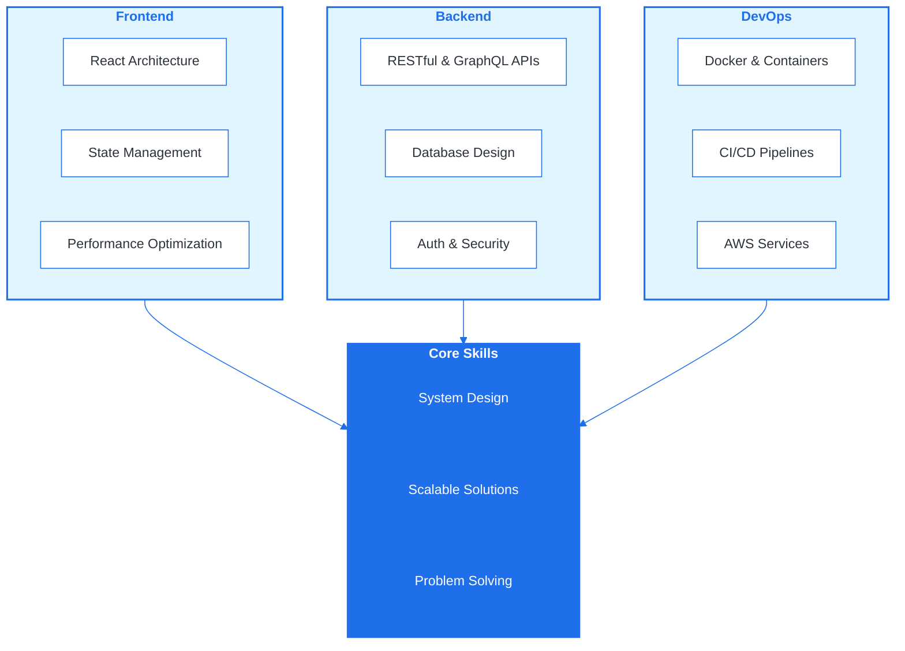
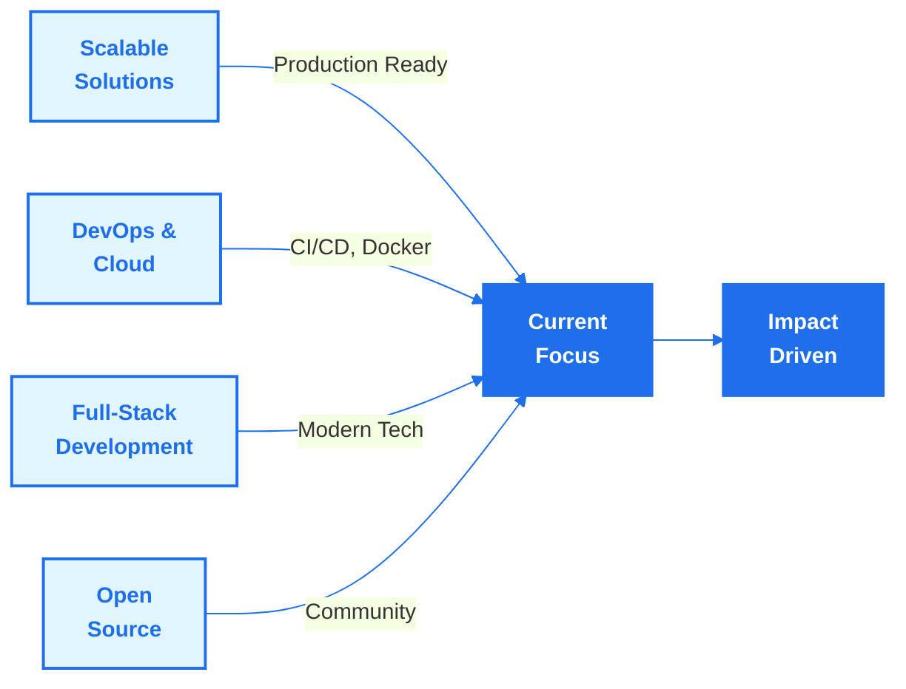

# VIKRANT KUMAR
<h2 style="font-size: 28px; margin: 15px 0; color: #fff; font-weight: 600; letter-spacing: 1px;">
  { Full-Stack Developer }
</h2>

  🚀 Problem Solver &nbsp;•&nbsp; 💻 Full-Stack Architect &nbsp;•&nbsp; 🎯 Tech Innovator

  

    "Building elegant solutions that transform challenges into opportunities"
  

  

---

## 👨‍💻 Professional Profile

<table>
<tr>
<td width="45%" align="center">

</td>
<td width="55%">

### About Me

I'm a **full-stack developer** specializing in building scalable, high-impact solutions. With expertise spanning frontend, backend, and DevOps, I create products that solve real-world problems.

#### 🎯 Focus Areas
- ✦ HealthTech & Emergency Response Systems
- ✦ Full-Stack Web & Mobile Development  
- ✦ Cloud Infrastructure & DevOps
- ✦ Scalable System Architecture

#### 📍 Additional Info
- **Based in:** IIITDM Jabalpur, India
- **Experience:** Building production-grade applications
- **Mission:** Transform ideas into impact

</td>
</tr>
</table>

---

---

## 📊 Professional Snapshot

---

---

## 🛠️ Technical Expertise

### Frontend Development

| **React** | **Next.js** | **React Native** | **Tailwind CSS** | **TypeScript** |
|:---:|:---:|:---:|:---:|:---:|
|  |  |  |  |  |

### Backend Development

| **Node.js** | **Express.js** | **Python** | **GraphQL** | **PostgreSQL** |
|:---:|:---:|:---:|:---:|:---:|
|  |  |  |  |  |

### Databases & Cloud

| **MongoDB** | **Firebase** | **AWS** | **Docker** | **GitHub** |
|:---:|:---:|:---:|:---:|:---:|
|  |  |  |  |  |

---

---

## 💼 Core Competencies

---

---

## 🚀 Featured Projects

| S.No. | **Project** | **Tech Stack** | **Description** | **Status** |
|---|---|---|---|---|
| 1 | **Saviour** | `React Native` `Expo` `Firebase` `Typescript` | Community safety platform with real-time alerts and location-based emergency services | ✨ Active |
| 2 | **Saviour 2.0** | `React` `Node.js` `Firebase` `Typescript` | Advanced emergency response platform with real-time tracking and AI-powered resource allocation | ✨ Active |
| 3 | **IIITDMJ Website** | `React` `Tailwind` `Firebase` | Institutional website with dynamic content management and student portal integration | ✨ Active |
| 4 | **CFD Simulator** | `Python` `NumPy` `Matplotlib` | Computational fluid dynamics simulation engine with visualization tools | 📊 Research |
| 5 | **HydroTech** | `Python` `React` `Node.js` `MongoDB` | AI-Powered Groundwater Analytics | ✨ Active |

**📌 View Code & Live Demos:** [GitHub Repository](https://github.com/vikrantwiz02?tab=repositories) | [Portfolio](https://vikrant-portfolio-kappa.vercel.app)

---

## 📈 GitHub Analytics

---

## 🏆 Professional Certifications

<table style="border-collapse: collapse; width: 100%; max-width: 600px; margin: 0 auto; background: linear-gradient(135deg, #f8f9fa 0%, #ffffff 100%); border-radius: 12px; overflow: hidden; box-shadow: 0 4px 6px rgba(0,0,0,0.07);">
  <tr>
    <td style="padding: 25px; text-align: center; border-right: 1px solid #e5e7eb;">
      
🏅

      <strong style="color: #1f6feb; font-size: 16px; display: block;">Google IT Support Professional</strong>
      
Google Career Certificates

      
<em>2024</em>

    </td>
    <td style="padding: 25px; text-align: center;">
      
☁️

      <strong style="color: #1f6feb; font-size: 16px; display: block;">AWS Cloud Practitioner</strong>
      
Amazon Web Services

      
<em>2024</em>

    </td>
  </tr>
</table>

---

## 💬 Let's Collaborate

I'm passionate about solving challenging problems and building impactful products. Whether you're looking to discuss innovative ideas, need technical expertise, or want to explore collaboration opportunities, I'd love to connect.

**Reach out through:**

---

---

## 🎯 Current Focus

---

## ✨ Let's Build Something Extraordinary

  "Great things never came from comfort zones. Let's create impact together."

### 📧 Get in Touch

### 💼 Connect With Me

  

    Made with 💻 dedication and 🚀 expertise
  

  

    © 2026 Vikrant Kumar • All Rights Reserved
  

