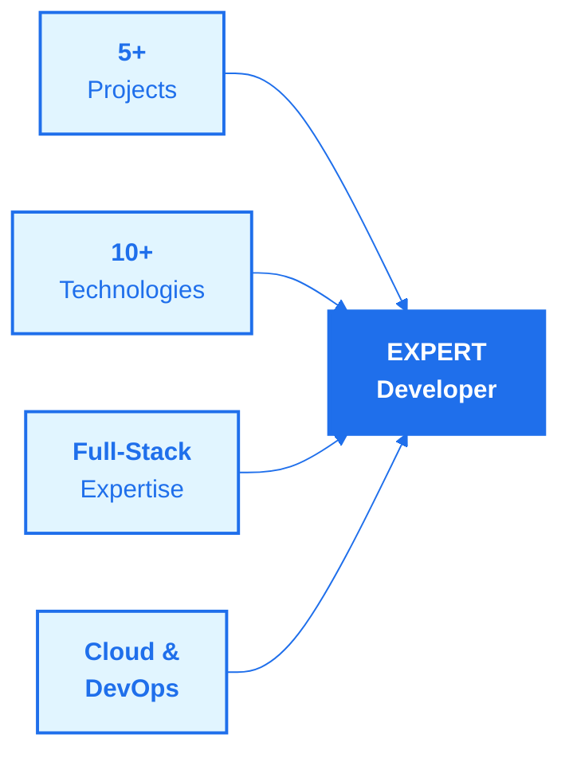
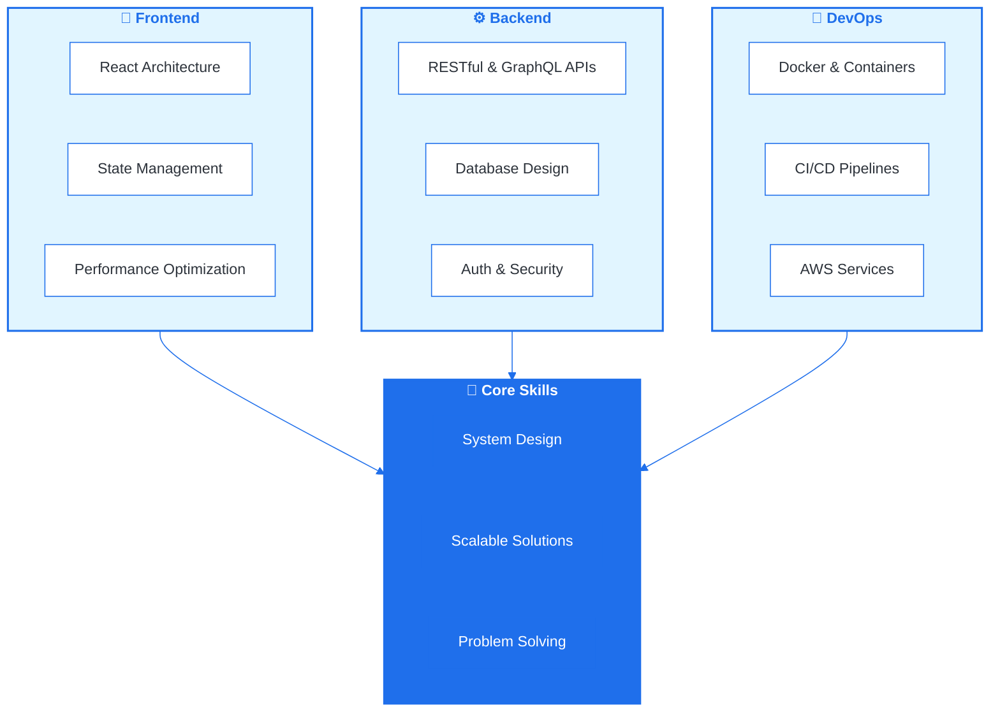
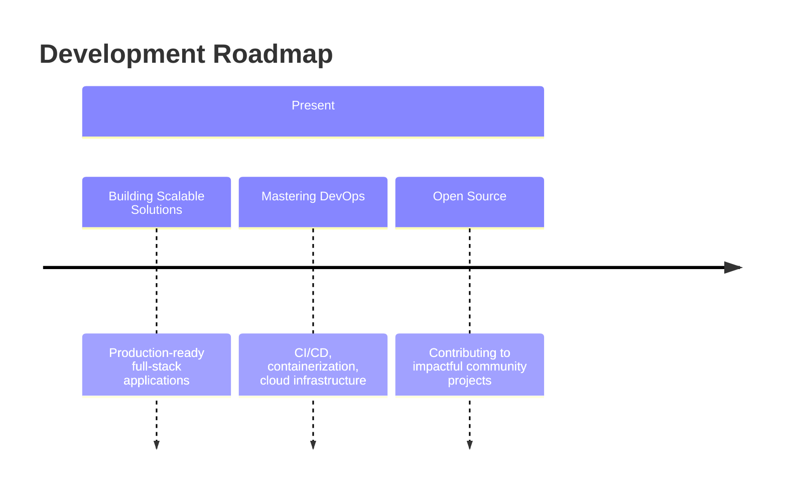

# VIKRANT KUMAR

  <strong>
    <a href="https://linkedin.com/in/vikrantwiz02" style="text-decoration: none; color: inherit;">Full-Stack Developer</a>
    &nbsp;•&nbsp;
    <a href="https://github.com/vikrantwiz02" style="text-decoration: none; color: inherit;">Problem Solver</a>
    &nbsp;•&nbsp;
    <a href="https://vikrant-portfolio-kappa.vercel.app" style="text-decoration: none; color: inherit;">Tech Enthusiast</a>
  </strong>

**Building elegant solutions that transform challenges into opportunities**

---

---

## 👨‍💻 Professional Profile

  <table style="border-collapse: collapse; background: linear-gradient(135deg, #f8f9fa 0%, #ffffff 100%); border-radius: 12px; overflow: hidden; box-shadow: 0 4px 6px rgba(0,0,0,0.07);">
    <tr>
      <td width="45%" style="padding: 20px; text-align: center;">
        
      </td>
      <td width="55%" style="padding: 30px; vertical-align: top;">
        <h3 style="font-size: 28px; margin: 0 0 15px 0; color: #1f6feb; font-family: 'Segoe UI', Tahoma, Geneva, Verdana, sans-serif;">About Me</h3>
        
        

          I'm a <strong>mission-driven full-stack developer</strong> specializing in building scalable, high-impact solutions. With expertise spanning frontend, backend, and DevOps, I create products that solve real-world problems and make a tangible difference.
        

        
        
<strong>🎯 Focus Areas:</strong>

        <ul style="text-align: left; color: #57606a; margin: 0; padding-left: 20px; line-height: 2;">
          <li style="margin: 5px 0;">HealthTech & Emergency Response Systems</li>
          <li style="margin: 5px 0;">Full-Stack Web & Mobile Development</li>
          <li style="margin: 5px 0;">Cloud Infrastructure & DevOps</li>
          <li style="margin: 5px 0;">Scalable System Architecture</li>
        </ul>

        

          <strong>📍 Based in:</strong> IIITDM Jabalpur, India 
          <strong>💼 Experience:</strong> Building production-grade applications 
          <strong>🚀 Mission:</strong> Transform ideas into impact
        

      </td>
    </tr>
  </table>

---

---

## 📊 Professional Snapshot

---

---

## 🛠️ Technical Expertise

### Frontend Development

| **React** | **Next.js** | **React Native** | **Tailwind CSS** | **TypeScript** |
|:---:|:---:|:---:|:---:|:---:|
|  |  |  |  |  |

### Backend Development

| **Node.js** | **Express.js** | **Python** | **GraphQL** | **PostgreSQL** |
|:---:|:---:|:---:|:---:|:---:|
|  |  |  |  |  |

### Databases & Cloud

| **MongoDB** | **Firebase** | **AWS** | **Docker** | **GitHub** |
|:---:|:---:|:---:|:---:|:---:|
|  |  |  |  |  |

---

---

## 💼 Core Competencies

---

## 🚀 Featured Projects

| Project | Technology Stack | Description |
|---------|------------------|-------------|
| **Saviour 2.0** | React Native, Firebase | Disaster management platform with real-time alerts, navigation assistance, and resource tracking. Designed to save lives during emergencies. |
| **IIITDMJ Website** | React, Node.js, MongoDB | Comprehensive full-stack platform providing insights into academics, campus life, and events. Fully responsive design with intuitive UX. |
| **Saviour** | React, Firebase | Emergency response platform with real-time disaster management capabilities and seamless integration. |
| **CFD Simulator** | Python, OpenFOAM | Advanced cardiovascular biomaterial simulator for medical device optimization using computational fluid dynamics. |

**📌 View Code & Live Demos:** [GitHub Repository](https://github.com/vikrantwiz02) | [Portfolio](https://vikrant-portfolio-kappa.vercel.app)

---

## 📈 GitHub Analytics

---

## 🏆 Professional Certifications

| Certification | Issuer |
|:---:|:---:|
|  | Google |
|  | Amazon Web Services |
|  | Accenture |
|  | KPMG |
|  | Goldman Sachs |

---

## 💬 Let's Collaborate

I'm passionate about solving challenging problems and building impactful products. Whether you're looking to discuss innovative ideas, need technical expertise, or want to explore collaboration opportunities, I'd love to connect.

**Reach out through:**

---

## 🎯 Current Focus

---

**Let's build something extraordinary together.**

Made with dedication and expertise | © 2025

